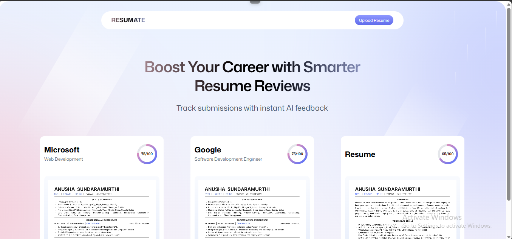
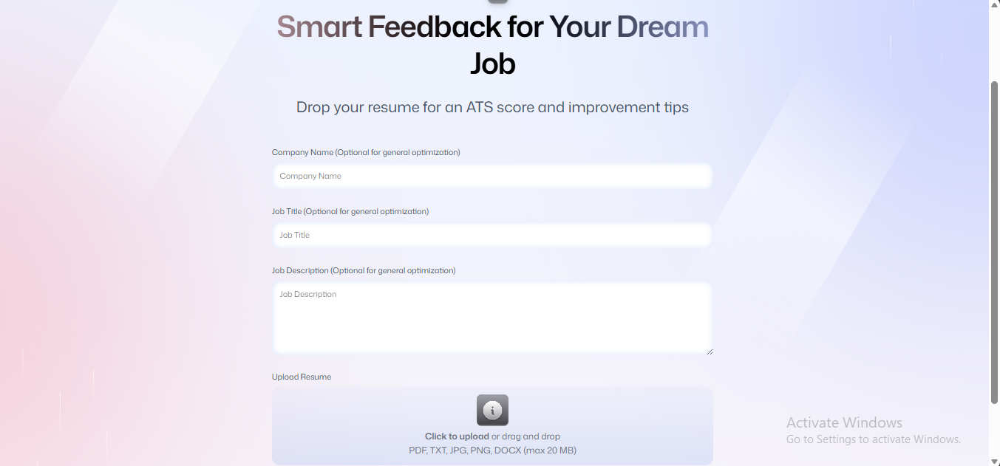
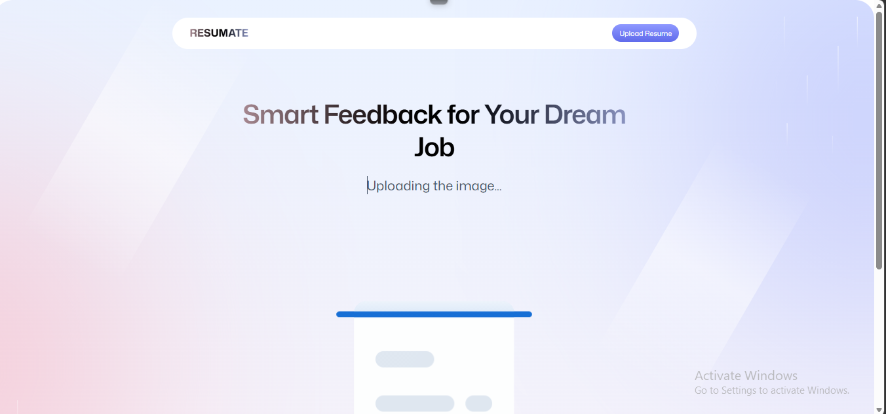
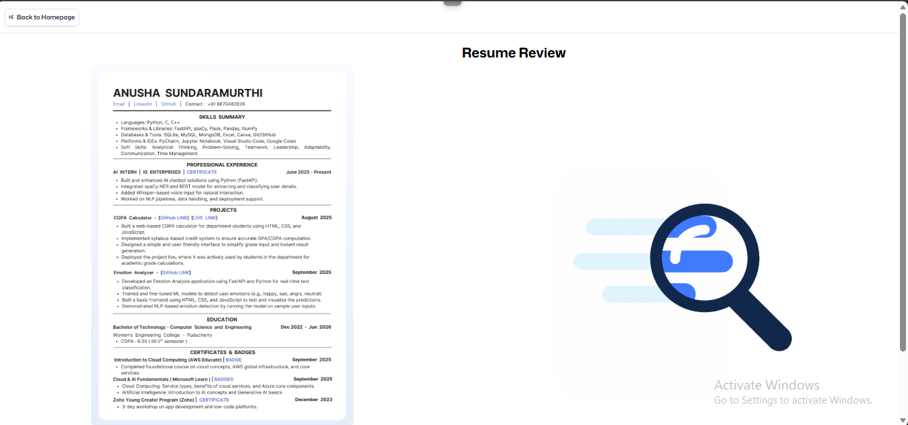

# 📄 ResuMate — AI Resume Analyzer

---

## 📌 Project Description

**ResuMate** is an AI-powered Resume Analyzer that helps job seekers boost their career prospects with smarter resume reviews. Users can upload their resume, optionally provide a target company name, job title, and job description, and instantly receive an **ATS score** along with **AI-generated improvement tips** powered by the **Claude API**.

The system uses **Puter.js** as the backend for authentication and resume storage, making resumes accessible anytime from anywhere.

---

## 🎯 Objective of the Application

The main objective is to develop a system that:

• Uploads resumes in multiple formats (PDF, TXT, JPG, PNG, DOCX)  
• Stores resumes securely using Puter cloud storage  
• Analyzes resumes using the Claude API  
• Generates ATS scores out of 100  
• Provides tailored feedback based on specific Company, Job Title, and Job Description  
• Optimizes and allows downloading the improved resume  
• Tracks all past resume submissions with scores on the dashboard  

---

## 🛠 Tools and Technologies Used

| Tool | Purpose |
|---|---|
| HTML | Frontend Structure |
| Tailwind CSS | Utility-first Styling & UI Design |
| TypeScript | Strongly-typed Frontend Logic |
| Puter.js | Backend — Authentication & Resume Cloud Storage |
| Claude API (Anthropic) | ATS Score Generation & Resume Analysis |
| Puter KV Store | Resume data persistence |

---

## 🚀 Project Preview

### 🏠 Home — Dashboard with Resume Submissions


---

### 📤 Upload Resume & Job Details Form


---

### ⏳ Uploading Resume


---

### 🔍 Analyzing Resume


---

### 📖 Resume Review Page


---

## ⚙️ How the System Works

```
Upload Resume (PDF / TXT / JPG / PNG / DOCX)
         ↓
  Enter Company Name, Job Title, Job Description (Optional)
         ↓
  Resume stored in Puter Cloud Storage
         ↓
  Claude API analyzes the resume
         ↓
  ATS Score (out of 100) generated
         ↓
  Improvement tips & optimized resume returned
         ↓
  Results displayed + Download optimized resume
         ↓
  Submission tracked on Dashboard
```

---


## 🚀 Project Features

✅ Upload Resume in any format (PDF, TXT, JPG, PNG, DOCX)  
✅ Optional Job Targeting (Company Name, Job Title, Job Description)  
✅ AI-Powered ATS Score (out of 100) via Claude API  
✅ Instant Resume Improvement Tips  
✅ Optimized Resume Download  
✅ Resume Cloud Storage via Puter  
✅ Authentication via Puter  
✅ Dashboard to track all past submissions with scores  
✅ Resume accessible anytime from the library  
✅ Real-time upload and analysis progress indicators  

---

## 🧠 AI & Backend Details

### Claude API — ATS Scoring & Analysis

The Claude API is used to:

• Parse and understand the resume content  
• Compare it against the provided job description and role  
• Calculate an ATS compatibility score out of 100  
• Generate detailed improvement suggestions  
• Produce an optimized version of the resume  

### Puter.js — Backend

Puter.js handles:

• User authentication (login/signup)  
• Resume file storage in Puter cloud  
• Resume metadata persistence via Puter KV store  
• Fetching stored resumes for the dashboard view  

---

## 📊 ATS Score Breakdown

| Score Range | Meaning |
|---|---|
| 80 – 100 | Excellent — Strong ATS match |
| 60 – 79 | Good — Minor improvements needed |
| 40 – 59 | Average — Needs keyword optimization |
| 0 – 39 | Poor — Major restructuring required |

---

## 👩‍💻 Author

**Name:** Anusha Sundaramurthi  
**Course:** B.Tech — Computer Science and Engineering  
**College:** Women's Engineering College, Puducherry  
**Project:** ResuMate — AI Resume Analyzer  

---

## 📌 GitHub Repository

```
https://github.com/anusha-sundaramurthi/ai-resume-tracker
```

---

## ⭐ Conclusion

ReSumate demonstrates a real-world implementation of an AI-powered career tool using the **Claude API** for intelligent resume analysis and **Puter.js** for serverless authentication and cloud storage. It helps job seekers tailor their resumes to specific companies and roles, improving their chances of passing ATS filters and landing their dream jobs.

---
